# Jira SLA Data Engineering Platform  
### Enterprise-Grade Medallion Architecture (Bronze → Silver → Gold)

[]()
[]()
[](https://github.com/brmsouza/jira-sla-python/releases)

<p align="center">
  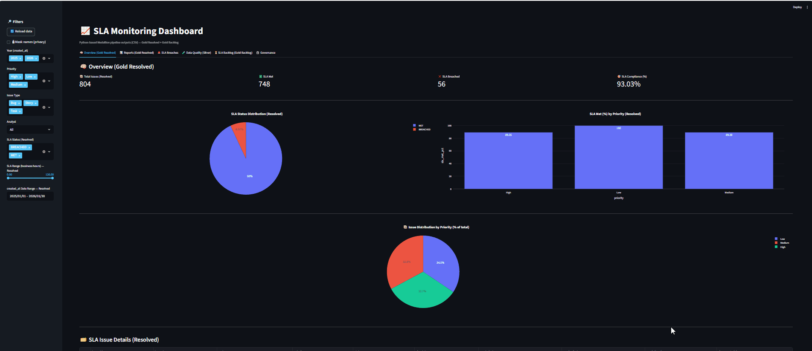
</p>


Enterprise-grade Data Engineering solution for SLA monitoring, governance, and analytical reporting using a Python-only Medallion architecture.

---

# Quick Start

```bash
git clone https://github.com/brmsouza/jira-sla-python.git
cd jira-sla-python

python -m venv .venv
.venv\Scripts\activate   # Windows
pip install -r requirements.txt

python main.py
streamlit run src/dashboard/app.py
```

---

# Table of Contents

1. [Executive Summary](#executive-summary)
2. [Business Impact](#business-impact)
3. [Architectural Principles](#architectural-principles)
4. [Medallion Architecture](#medallion-architecture)
5. [Architecture Diagram](#architecture-diagram)
6. [Data Contracts](#data-contracts)
7. [SLA Model Design](#sla-model-design)
8. [Governance & Observability](#governance--observability)
9. [Data Quality Framework](#data-quality-framework)
10. [Validation & Data Integrity](#validation--data-integrity)
11. [Data Privacy & Repository Strategy](#data-privacy--repository-strategy)
12. [Reproducibility Model](#reproducibility-model)
13. [Project Structure](#project-structure)
14. [Dashboard Preview](#dashboard-preview)
15. [Pipeline Execution](#pipeline-execution)
16. [Dashboard Capabilities](#dashboard-capabilities)
17. [Enterprise Controls](#enterprise-controls)
18. [Future Roadmap](#future-roadmap)
19. [Author](#author)

---

# Executive Summary

This platform delivers a structured and auditable SLA calculation framework based on Jira issue data.

The solution was designed using modern Data Engineering principles:

- Medallion Architecture
- Domain separation
- Data contracts
- Deterministic processing
- Observability-first design
- Governance by default

It ensures reliable SLA computation based on business hours while maintaining traceability, reproducibility, and architectural clarity.

---

# Business Impact

This solution enables:

- Transparent SLA compliance monitoring
- Risk identification (SLA breaches)
- Operational backlog visibility
- Analyst performance insights
- Deterministic and auditable data flows

It demonstrates production-ready engineering patterns aligned with enterprise data platforms.

---

# Architectural Principles

## Domain Separation

Strict separation between:

- Bronze (Raw Domain)
- Silver (Trust Domain)
- Gold (Analytics Domain)

Each layer exposes explicit contracts and prevents cross-layer leakage.

## Deterministic Execution

- Idempotent processing
- Re-runnable pipeline
- No duplication
- Controlled artifact overwriting

## Governance by Design

- Execution run logs
- Row count tracking
- Data lineage file
- Data quality metrics
- Structured error capture

---

# Medallion Architecture

## Bronze — Raw Domain

Immutable ingestion layer.

- Stores raw Jira JSON
- No transformation
- No mutation
- Full traceability preserved

Output:
```
data/bronze/jira_issues_raw.json
```

## Silver — Trust Domain

Standardization and validation layer.

- JSON flattening
- Datetime parsing & UTC normalization
- Business calendar generation
- Data Quality classification (VALID / MISSING / INVALID)
- Explicit DQ metrics output

Outputs:
```
data/silver/silver_issues_valid.csv
data/silver/silver_issues_invalid.csv
data/silver/silver_calendar.csv
data/silver/silver_dq.json
```

## Gold — Analytics Domain

Business modeling layer.

- Business-hours SLA calculation
- SLA expected hours by priority
- SLA compliance indicator
- Backlog SLA modeling
- Aggregated KPI datasets

Outputs:
```
data/gold/gold_sla_issues.csv
data/gold/gold_sla_backlog.csv
```

---

# Architecture Diagram

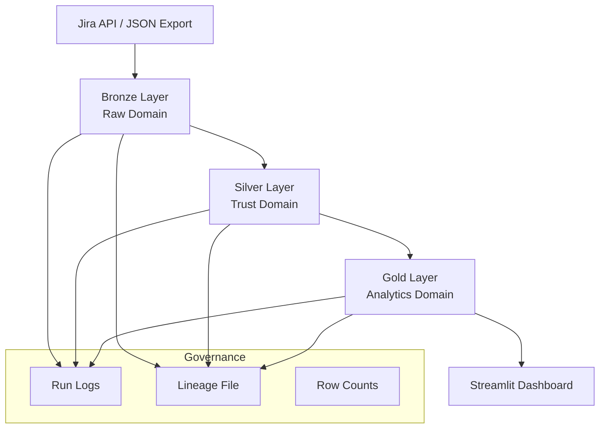

---

# Data Contracts

## Bronze Contract
- Raw schema preserved
- Immutable storage
- No structural mutation

## Silver Contract
- Validated timestamps
- Normalized schema
- Invalid records isolated
- Calendar available
- DQ metrics generated

## Gold Contract
- resolution_hours
- sla_expected_hours
- sla_status
- sla_met
- Aggregated KPI datasets

Contracts ensure safe downstream consumption.

---

# SLA Model Design

Business-Hours Equivalent Model:

- Business days only (Mon–Fri)
- Holidays excluded
- SLA applied only to Done / Resolved issues

| Priority | SLA (Business Hours) |
|----------|---------------------|
| High     | 24 |
| Medium   | 72 |
| Low      | 120 |

---

# Governance & Observability

Governance artifacts:

```
data/audit/run_log.csv
data/audit/lineage.json
```

Tracked metadata:

- Step name
- Execution timestamp
- Layer transition
- Output row counts
- Status (success / failure)

Operational metadata is decoupled from business logic.

---

# Data Quality Framework

Silver layer classification:

- VALID
- MISSING
- INVALID

Validation includes:

- Invalid datetime values
- Missing timestamps
- Logical inconsistencies
- Business rule violations

DQ metrics stored in:

```
data/silver/silver_dq.json
```

---

# Validation & Data Integrity

The Silver layer enforces strict timestamp validation before promoting records to the trusted domain.

Validation rules include:

1. Defensive datetime parsing using:
   `pd.to_datetime(..., errors="coerce", utc=True)`

2. Missing timestamp detection.

3. Logical temporal consistency validation.

Critical business rule:

```
resolved_at >= created_at
```

If:

```
resolved_at < created_at
```

The record is classified as:

```
INVALID_TEMPORAL_SEQUENCE
```

This prevents:

- Negative SLA calculations  
- False SLA compliance  
- Corrupted analytics  
- Downstream metric distortion  

All timestamps are normalized to UTC and stored as timezone-aware values to ensure deterministic behavior.

---

# Data Privacy & Repository Strategy

All generated datasets inside:

```
data/bronze/
data/silver/
data/gold/
```

are intentionally excluded via `.gitignore`.

## Rationale

- Jira exports may contain sensitive information  
- Prevent accidental public exposure  
- Ensure deterministic rebuilds  
- Repository stores logic, not data  

---

# Reproducibility Model

Instead of storing artifacts in Git:

```
Code → Pipeline → Deterministic Outputs
```

All outputs can be regenerated by:

```bash
python main.py
```

This guarantees:

- Idempotent execution  
- Clean rebuilds  
- Transparent artifact generation  
- No hidden state dependencies  

---
---

# Project Structure

```
src/
 ├── bronze/
 ├── silver/
 ├── gold/
 ├── common/
 │     ├── governance.py
 │     ├── logger.py
 │     ├── dates.py
 │     ├── config.py
 ├── pipeline/
 ├── dashboard/

data/
 ├── source/
 ├── bronze/
 ├── silver/
 ├── gold/
 └── audit/

main.py
requirements.txt
README.md
```

#  Dashboard Preview

## Deliverables

<p align="center">
  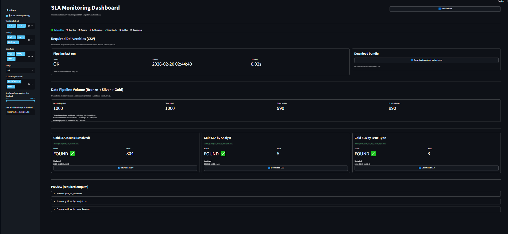
</p>

---

## Overview (Gold Resolved)

<p align="center">
  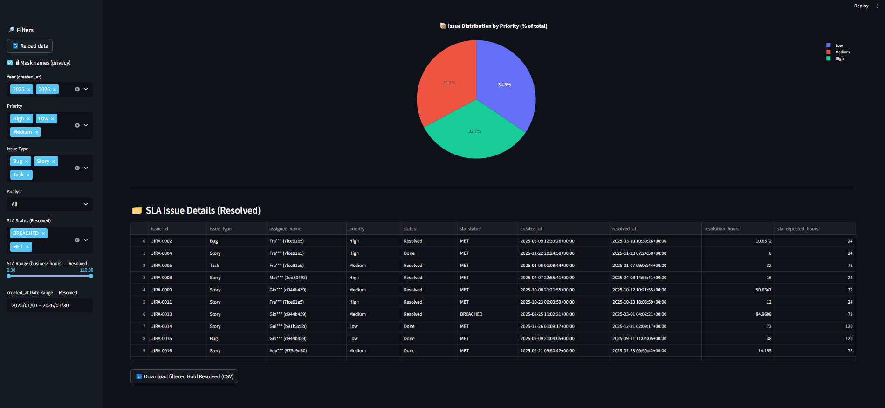
</p>

---

## Reports (Analyst & Issue Type)

<p align="center">
  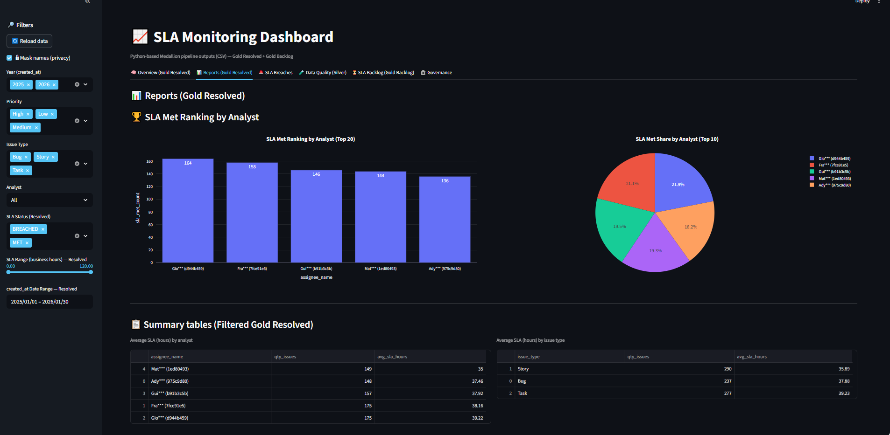
</p>

---


## SLA Breaches Analysis

<p align="center">
  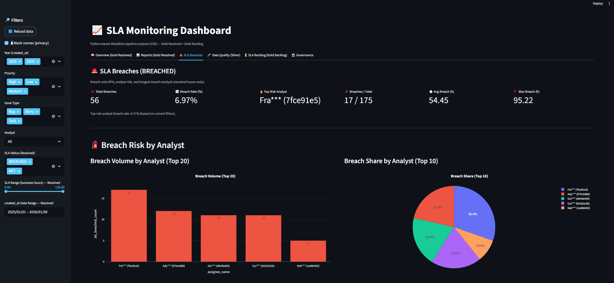
</p>

<p align="center">
  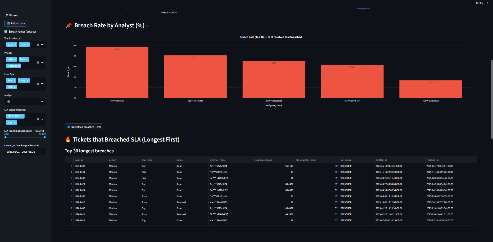
</p>

<p align="center">
  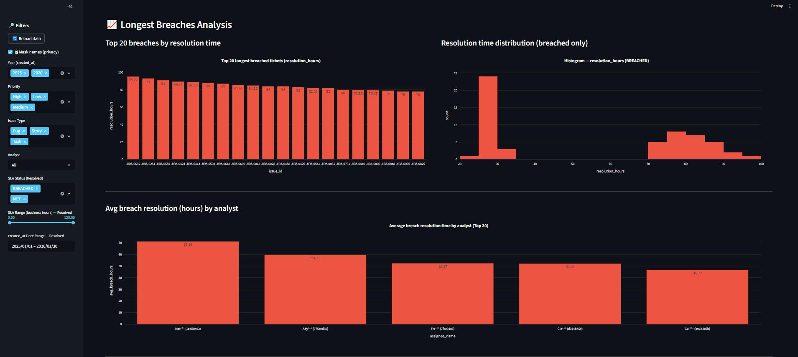
</p>

---

## Data Quality (Silver)

<p align="center">
  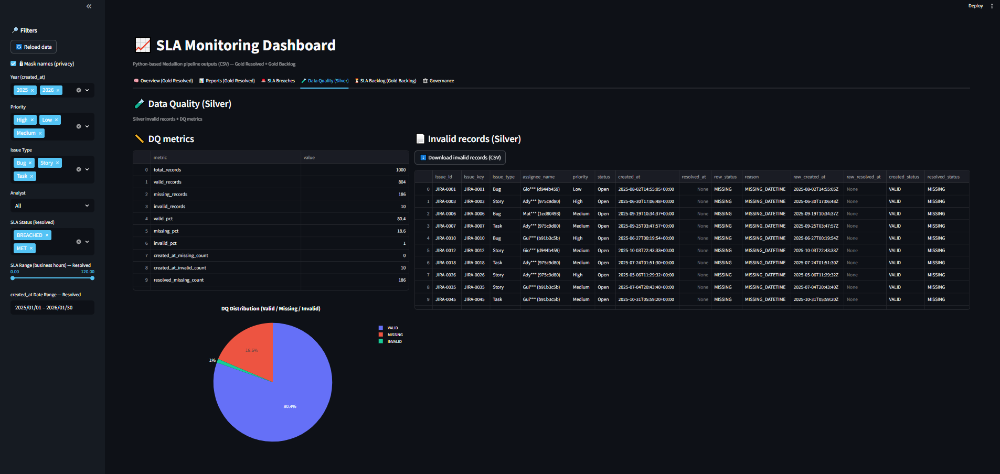
</p>

---
## SLA Backlog Monitoring

<p align="center">
  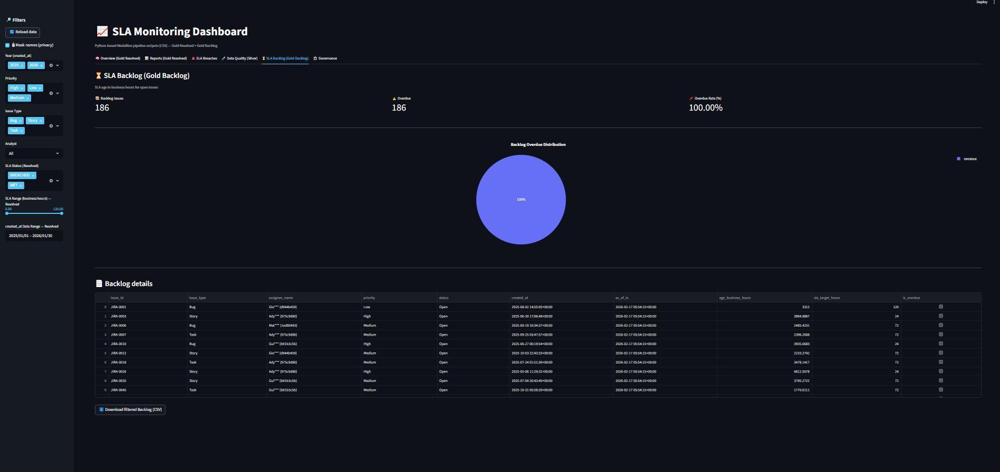
</p>

---

## Governance & Observability

<p align="center">
  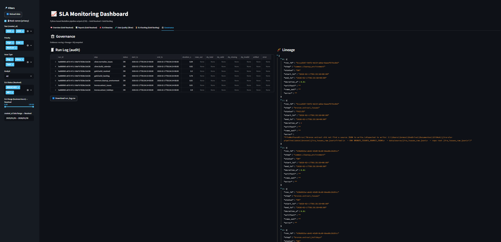
</p>

---
---

# Pipeline Execution

Run full pipeline:

```bash
python main.py
```

Run dashboard:

```bash
streamlit run src/dashboard/app.py
```

Pipeline is:

- Modular
- Governance-enabled
- Deterministic
- Layer-aware

---

# Dashboard Capabilities

- SLA compliance ratio
- MET vs BREACHED distribution
- Priority breakdown
- Analyst ranking
- Backlog overdue monitoring
- Data Quality visualization
- Governance visibility

---

# Enterprise Controls

- Defensive datetime parsing
- UTC normalization
- Holiday-aware calendar
- Explicit null handling
- Idempotent writes
- Layer contract enforcement
- Deterministic outputs
- Structured logging

---

# Future Roadmap

- Docker containerization
- Cloud-native storage integration

---

# Author

Bruno Souza  
Jira SLA Data Engineering Platform — 2026  
Architecture: Medallion  
Language: Python  
Dashboard: Streamlit  
